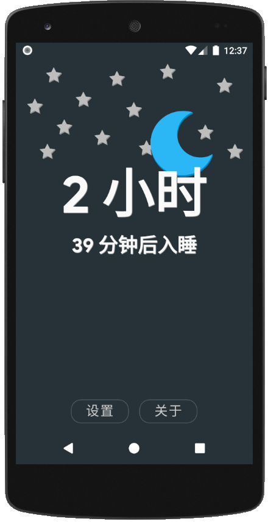
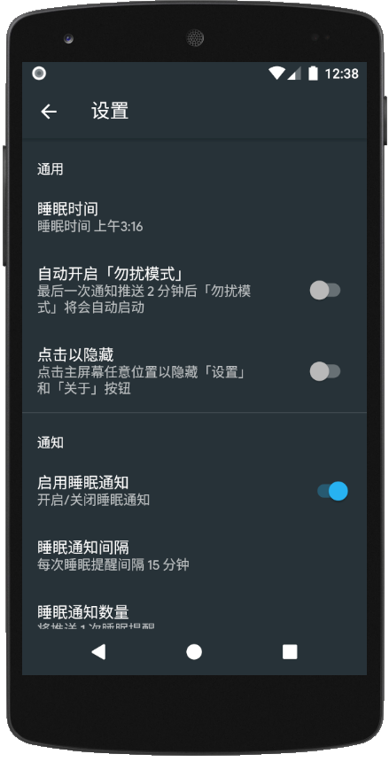
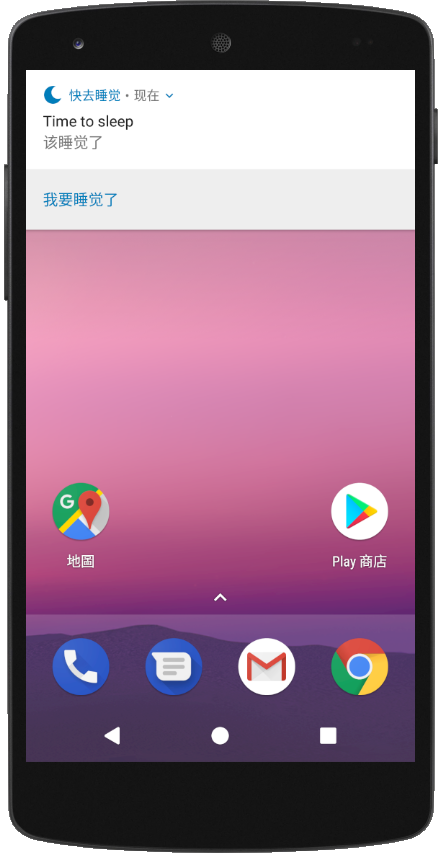

# NowSleep

> 注意：这是一个老版本的存档，新版本见master branch

这是一个免费且开源的安卓应用，原作者CorvetteCole <https://github.com/CorvetteCole/GotoSleep>

<a href="./README.md">English Document (英文文档)</a>

## 应用截图

## Features

* 睡眠提醒
* 自动开启「勿扰模式」
* 智能通知
* 个性化通知

## 更新日志

### Version 1.0.0

由原作者 CorvetteCole <https://github.com/CorvetteCole/GotoSleep> 的代码修改而来

#### What's New

- 移除广告
- 默认解锁所有高级功能
- 汉化应用

#### Bug 修复

* 修复了通知问题：安卓8.0 (API level 26) 以下设备通知没有提示音

#### 开发日志

- 重写了 SettingsFragment, 将其命名为 SettingsFragment2, 使代码更加整洁可读
- 对 preferences.xml 进行了小修改, 将其命名为 preferences2.xml
- 由于目前没有国外用户 :(  ，删除了其它语言的翻译以保证代码逻辑的简洁

## 联系我

邮箱 qianzch@qq.com