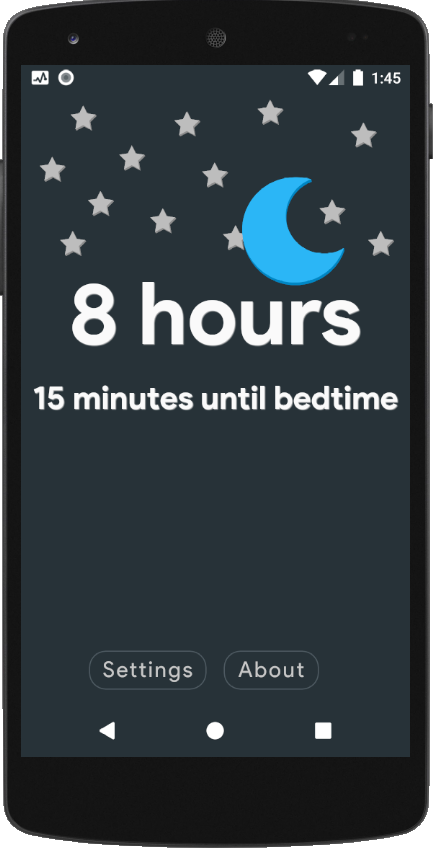
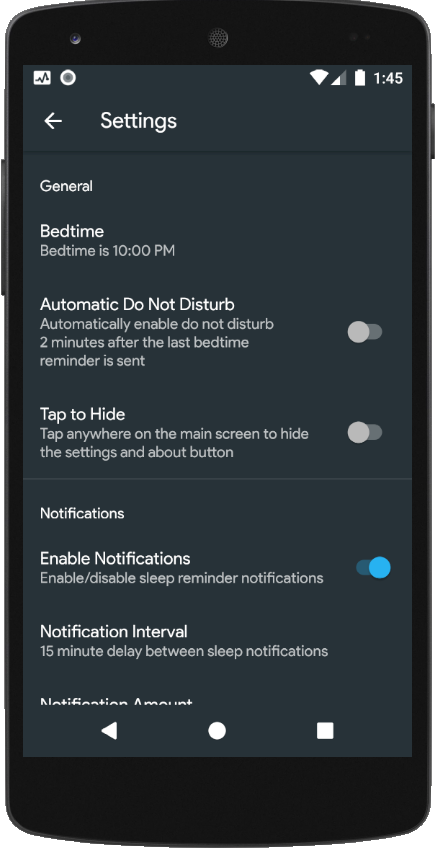
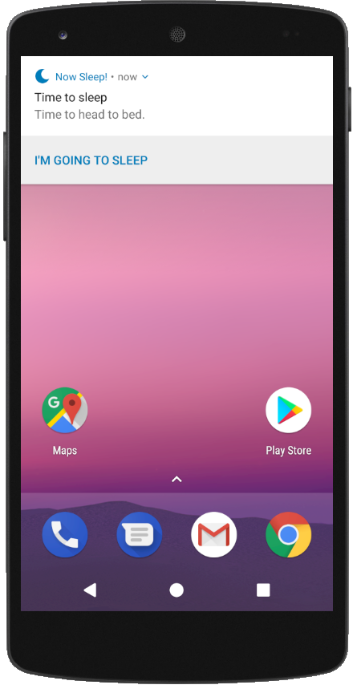

# NowSleep
> Note: this is an old version archive, for newest version, see master branch

This is an free open-source Android app, originally from the great author CorvetteCole <https://github.com/CorvetteCole/GotoSleep>

<a href="./README-CN.md">中文文档 (Chinese Document)</a>

## Screenshots

## Features

* Sleep Reminder
* Auto Do Not Disturb
* Smart Notifications
* Custom Notifications

## What's New

### Version 1.0.0

Modified code from <https://github.com/CorvetteCole/GotoSleep>, thanks for your great work, CorvetteCole!

#### What's New

- Remove ads
- Unlock all advanced options by default
- Full Chinese translation

#### Bug Fixes

* Fixed a notification issue: no sound for Android versions under 8.0 (API level 26)

#### For Developer

- Re-write SettingsFragment, now named SettingsFragment2, to keep code simple and readable
- Minor change to preferences.xml, now preferences2.xml
- Deleted other translations for the sake of keeping code simple, currently no foreign users :( 

## Contact Me

Contact me at qianzch@qq.com